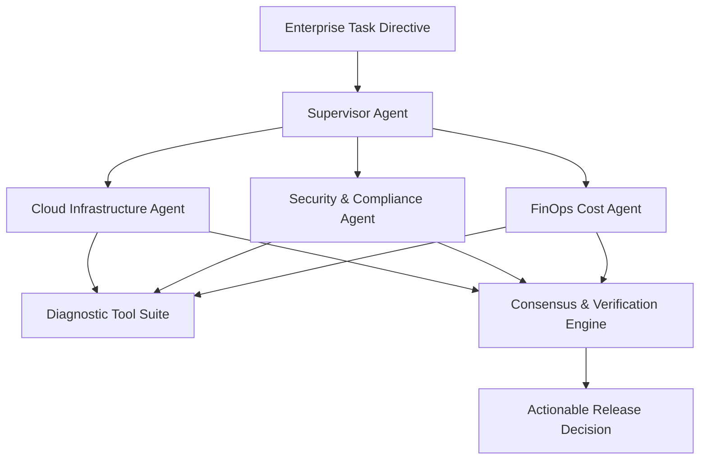

cat << 'EOF' > README.md
# Enterprise Multi-Agent Orchestrator

A modular, state-driven multi-agent orchestrator built with **LangGraph** and **LangChain**. Dispatches complex enterprise directives across specialized autonomous sub-agents (Cloud Infrastructure, Security Compliance, and FinOps), performs parallel diagnostic tool executions, and consolidates findings into a verified consensus action plan.

---

## Architectural Workflow

## Key Features

Stateful Message Passing: Leverages LangGraph's StateGraph and typed state dictionaries to manage immutable communication across agent boundaries.

Parallel Fan-Out Execution: Executes domain-specific agents simultaneously to minimize end-to-end reasoning latency.

Shift-Left Automated Evaluation: Incorporates pipeline evaluations in GitHub Actions that test graph compilation, multi-agent fan-out completeness, and synthesis assertions.

Interactive Control Plane: Built-in Streamlit UI to trigger custom directives, review raw agent payloads, and audit decision plans.
